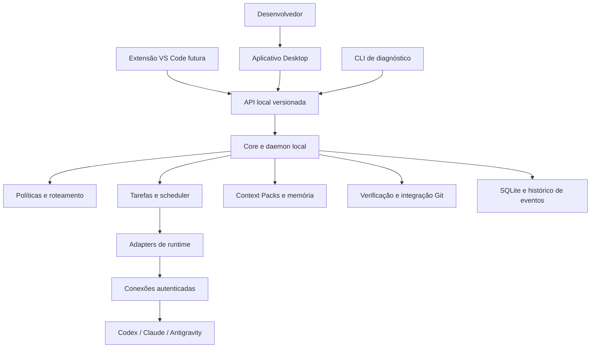

# Plano de desenvolvimento do Orchestrix

O Orchestrix deve permitir que o desenvolvedor defina um objetivo, conecte seus agentes de código e acompanhe um sistema que planeja, distribui, verifica e integra o trabalho. A escolha de conta, runtime, modelo, esforço de raciocínio e contexto deve seguir políticas configuráveis e produzir decisões explicáveis.

O caminho proposto começa por pesquisa aprofundada de soluções semelhantes e experiência de uso. Essa pesquisa orienta uma execução confiável e um aplicativo com identidade visual, organização clara e conforto para desenvolver. A autonomia cresce sobre essa base. Múltiplas contas do mesmo provedor fazem parte do domínio desde o início; sua execução simultânea depende das capacidades e condições de integração de cada runtime.

**Estado em 9 de outubro de 2026:** D0 está concluído como pesquisa, com [conclusão, decisões e revisão explícita do critério metodológico](./research/d0-conclusion.md). D1 tem [protótipo e 24 cenários técnicos aprovados](./design/d1-delivery.md); o piloto humano permanece pendente. A [execução do plano](./DEVELOPMENT_STATUS.md) também registra o [primeiro percurso real Codex](./research/runtime-harness-results.md) antecipado e a [preparação offline de lifecycle](./research/offline-lifecycle-validation.md). Autenticação via assinatura, resposta e interrupção foram observadas no primeiro harness; retomada, contenção/término da árvore e contas independentes permanecem pendentes. A continuação offline não retoma M0 nem amplia capacidades reais do provider. O aplicativo de produção ainda não está implementado. Os [ADRs 0001 a 0004](./README.md#architecture-decision-records) continuam sendo as decisões aceitas; o [backlog](./DEVELOPMENT_BACKLOG.md) mantém os gates de piloto e implementação.

## 1 Objetivo de produto

O usuário deve poder abrir um repositório, conectar uma ou mais contas próprias e pedir algo como: “implemente autenticação e faça uma revisão de segurança”. O Orchestrix prepara um plano, mostra suas escolhas, executa tarefas em ambientes separados, encaminha resultados entre agentes, roda verificações e apresenta a integração para aprovação conforme a política.

O Desktop é um workspace de desenvolvimento assistido: o usuário formula trabalho, fornece contexto, examina código/diffs e pede correções dentro do aplicativo. A qualidade visual e a adaptação da interface fazem parte do produto desde o primeiro alpha. Edição leve com indentação pode ser incluída conforme a pesquisa, sem assumir o escopo de IDE, debugger ou ambiente integrado de testes. As verificações executadas pelo Core continuam produzindo evidências para revisão.

Três configurações devem usar o mesmo núcleo:

| Configuração | Comportamento esperado |
| --- | --- |
| Uma conta Codex | Planejamento, implementação e revisão em sessões separadas, respeitando a capacidade da conta. |
| Duas contas Codex | Seleção entre conexões autenticadas distintas, com disponibilidade e limites próprios quando confirmados pelo provedor. |
| Codex, Claude e Antigravity | Distribuição por papel, capacidade, preferência, disponibilidade e política de revisão. |

Mais sessões não significam mais cota. Mais contas também não garantem limites independentes: o sistema precisa representar grupos de capacidade compartilhada quando existirem. Uma sessão existente permanece vinculada à conexão que a criou; trocar de conta ou provedor inicia uma nova sessão com um novo Context Pack.

A autonomia terá três níveis configuráveis: acompanhamento manual de tarefas; execução de um plano aprovado; planejamento e replanejamento dentro dos limites autorizados pelo usuário. Em todos eles, o Core mantém a autoridade sobre estado, permissões e integração.

## 2 Decisões existentes e ajustes necessários

As decisões aceitas já sustentam o produto: um único runtime é suficiente; modelo e thinking são políticas centrais; Desktop e futuras extensões usam um Core independente do editor; o provedor mantém sua conversação e o Orchestrix mantém o conhecimento durável do projeto.

Para tornar essa visão executável, o desenvolvimento precisa corrigir seis lacunas:

1. O cadastro atual por `codex` ou `claude` precisa representar conexões e contas distintas.
2. Tarefa, tentativa, sessão e integração precisam ter estados separados.
3. Política, contexto básico, eventos e recuperação devem existir no primeiro fluxo útil.
4. A interface deve acompanhar o primeiro ciclo de implementação e revisão, antes da inteligência avançada.
5. Revisão com outro provedor deve ser uma preferência ou exigência explícita, preservando o funcionamento com um único runtime.
6. Pesquisa de similares, arquitetura de informação, design visual e validação de uso devem orientar a interface antes de sua implementação.

As 23 fases do [roadmap](./ROADMAP.md) permanecem um inventário de capacidades. A sequência de entrega proposta neste plano agrupa essas capacidades em resultados utilizáveis.

## Pesquisa inicial de solução e experiência

**D0 Pesquisa de produto:** estudar soluções de orquestração, runtimes/frameworks integráveis e referências de interação desktop. Comparar capacidades, arquitetura, contas, contexto, revisão, integração, recuperação e manutenção. Percorrer jornadas e reunir referências visuais anotadas; registrar o que adotar, adaptar ou descartar com evidência e motivo.

**D1 Design e validação:** criar jornadas, arquitetura de informação, wireframes e duas ou três direções visuais. Selecionar uma direção e produzir protótipo de alta fidelidade, tokens e estados de interface. Avaliar compreensão, conforto e capacidade de concluir o fluxo; corrigir problemas críticos antes de implementar o Desktop.

O [levantamento e pesquisa aprofundada](./PRODUCT_AND_UX_RESEARCH.md) consolidado em 08/10 reúne nove famílias: Conductor, Codex, Superset, Vibe Kanban, cmux, OpenHands, Cline, OpenCode e Antigravity, além de Linear, Raycast, GitHub Desktop e Fluent 2. A [conclusão de D0](./research/d0-conclusion.md) liga documentação, capturas e demos a prioridades e lacunas. É um benchmark de pesquisa, sem avaliação de produtividade/usabilidade dos concorrentes ou validação do design do Orchestrix.

O [complemento competitivo de 09/10](./research/competitive-update-2026-10-09.md) acrescenta Jackalope/Cobalt e evidência de múltiplas contas no Superset, ampliando o levantamento documental para onze famílias. A proposta central já tem concorrentes diretos. O plano deve avaliar vantagem em coordenação, compreensão, conforto e qualidade das decisões, conforme CMP-01 a CMP-05 e o protocolo comparativo proposto. OX-D05 valida entendimento; OX-017 permite medir execução; M3/M4 permitem comparar contas/roteamento. Essas hipóteses não acrescentam gates nem antecipam implementação.

A sequência principal é **D0 → D1 → M0 → M1 → M2**, seguida de M3 a M6. D0 foi consolidado; D1 aplicou seus resultados às jornadas e ao protótipo verificado; o próximo passo é executar/registrar o piloto com o responsável. Depois retomamos os spikes de M0, incluindo o candidato de [autorização própria para uso do plano ChatGPT](./research/subscription-account-ux.md). A avaliação externa continua até o alpha, conforme OX-D05. Protótipo e harness antecipados não fecham D1/M0. Dentro de cada marco, tarefas independentes podem avançar em paralelo.

## 3 Arquitetura de entrega



Manter a base proposta em [TECH_STACK.md](./TECH_STACK.md): Rust, Tokio, SQLite e Git CLI no Core; Tauri, React e TypeScript no Desktop. Confirmar a experiência de desenvolvimento e as dependências em um spike antes de registrar o compromisso em ADR. Escolher a biblioteca SQLite por um experimento pequeno com migração, transação e acesso concorrente.

Começar com poucos pacotes: `orchestrix-core`, módulos de infraestrutura/adapters, `orchestrix-daemon` e `apps/desktop`. Políticas, domínio, contexto, scheduler e verificação são módulos com limites explícitos; não precisam nascer como serviços separados. Extrair crates quando houver benefício concreto de testes, dependências ou reutilização.

O daemon será o proprietário dos processos e do banco. Desktop e CLI chamam comandos e consultas da mesma API de aplicação. Tipos do domínio não dependem de Tauri. Um transporte local versionado, com acesso restrito ao usuário, oferece comandos identificados, snapshots e eventos com cursor. Isso prepara a extensão VS Code sem implementá-la antecipadamente.

## 4 Modelo de domínio para múltiplas contas

| Conceito | Responsabilidade |
| --- | --- |
| Provider | Identifica a plataforma, como OpenAI, Anthropic ou Google. |
| RuntimeAdapter | Implementa o contrato de integração e traduz capacidades e eventos. |
| RuntimeInstallation | Guarda executável, versão detectada e estado de instalação. |
| Connection | Vincula instalação, referência de conta, autenticação selecionada e modo de cobrança. |
| CapacityGroup | Representa limites compartilhados entre conexões, quando conhecidos. |
| AgentProfile | Define papel, permissões e preferências de modelo, raciocínio e contexto. |
| ExecutionRun | Agrupa a execução de um objetivo e suas revisões de plano. |
| Task | Guarda objetivo, dependências, critérios de aceite, risco e resultados necessários. |
| TaskAttempt | Registra uma tentativa, revisão do plano, política efetiva, conexão, contexto, base, worktree e evidências. |
| RuntimeSession | Referencia a conversação do provedor, vinculada à conexão original. |
| IntegrationAttempt | Registra aplicação do resultado sobre uma base e sua verificação final. |

`codex-pessoal-a` e `codex-pessoal-b` são duas Connections que usam o mesmo adapter. Implementador e revisor são perfis, e podem usar qualquer conexão elegível. Identidade da conta e papel do agente permanecem conceitos separados.

O registro de conexões e as referências de autenticação ficam no estado local da aplicação. A política compartilhável do projeto guarda IDs e preferências, sem credenciais. Ao importar uma política, validar e remapear essas referências explicitamente antes de executar; um ID de outra instalação não autoriza selecionar uma conta local diferente. Usar autenticação oficial do runtime e armazenamento seguro do sistema operacional onde aplicável; não extrair tokens para redistribuição nem colocar segredos em eventos.

## 5 Escolha de conta, modelo e thinking

O primeiro router deve ser determinístico. Primeiro elimina candidatos incompatíveis com requisitos obrigatórios: autenticação, modo de cobrança, permissões, capacidades, exigência de revisão e capacidade de execução. Depois aplica preferências ordenadas e disponibilidade. Histórico de desempenho entra apenas quando houver dados suficientes.

A seleção produz um registro com candidatos considerados, razões de exclusão, conexão escolhida, modelo solicitado e efetivo, reasoning solicitado e efetivo e fallback. Quando o runtime não confirma um parâmetro efetivo, o registro mostra `unknown` ou `runtime-managed`.

Para preferências, manter a precedência já proposta: sistema → usuário → projeto → perfil → categoria/risco → execução → tarefa. Restrições obrigatórias formam um conjunto de limites que overrides não podem ampliar sem autorização da política. Resolver conflitos explicitamente; uma preferência nunca remove uma obrigação.

O usuário poderá escolher presets iniciais como Equilibrado, Qualidade, Economia de assinatura e Personalizado. Cada preset é uma configuração inspecionável. “Modelo mais forte” usa uma ordem declarada pelo adapter ou pelo usuário, sem presumir que nomes de modelos estabelecem um ranking universal. `maximum` significa a configuração de raciocínio mais alta suportada naquela combinação de runtime e modelo.

Exemplo conceitual de política de projeto, ainda sem contrato público estável:

```yaml
execution:
  allowedConnections: [codex-pessoal-a, codex-pessoal-b, claude-pessoal]
  subscriptionOnly: true
  allowApiFallback: false
routing:
  implementation:
    preferredConnections: [claude-pessoal, codex-pessoal-a]
    reasoning: high
  review:
    preferredConnections: [codex-pessoal-b, codex-pessoal-a]
    reasoning: maximum
review:
  requireFreshSession: true
  preferDifferentProvider: true
  requireDifferentProvider: false
```

Na execução, a política vira um snapshot imutável. Alterações ao vivo afetam novas decisões e emitem eventos; reduzir concorrência impede novas admissões até atingir o limite, sem encerrar automaticamente trabalhos ativos. Uma exigência sem candidato elegível deixa a tarefa bloqueada com uma explicação.

O modo de assinatura precisa verificar a origem da autenticação e eventuais fallbacks do runtime. Remover variáveis de API é apenas uma parte dessa verificação. Se o modo de cobrança não puder ser confirmado, uma política estrita não inicia a execução.

## 6 Contexto que acompanha o trabalho

O Context Compiler inicial usa seleção explícita e regras simples. Inclui objetivo, critérios de aceite, restrições, arquivos relevantes, instruções do repositório, ADRs pertinentes, artefatos das dependências e falhas verificadas relacionadas.

Cada pacote guarda um manifesto com fontes, commits ou hashes, itens omitidos, versão e orçamento estimado. Conteúdo excessivo é omitido ou resumido com indicação de origem. Orçamentos devem distinguir estimativas locais de limites efetivamente informados pelo runtime.

O revisor recebe critérios, diff e evidências de testes em uma sessão independente. A narrativa do implementador pode ser uma observação identificada, mas não substitui a inspeção do resultado. Ao mudar de provedor, o sistema reconstrói o pacote a partir do estado durável; não tenta transferir a conversa interna nem o raciocínio oculto do modelo.

Busca semântica, embeddings e resumos sofisticados entram depois de demonstrar onde a seleção básica perde informação relevante.

## 7 Contratos de execução e integração

Persistir estado atual e eventos de auditoria na mesma transação SQLite. Admissão de tarefa, reserva de capacidade e locks também precisam ser atômicas. Comandos têm chave de idempotência; eventos têm sequência, versão, `runId`, `taskId` e `attemptId`. Event sourcing integral não é necessário para o MVP.

Cada tentativa modificadora recebe base Git explícita e worktree próprio. Uma tentativa de correção parte do artefato rejeitado identificado, preservando a implementação anterior e sua proveniência. Alterações preexistentes do usuário são registradas e preservadas. Concluir uma tentativa não conclui automaticamente a tarefa: verificação, revisão e integração possuem resultados próprios.

Para tarefas que produzem código, `Task.COMPLETED` exige artefato integrado na branch do run e validação aprovada. Tarefas de análise podem concluir com um artefato aceito, sem integração Git. O contrato de dependência declara qual resultado libera tarefas seguintes. Inicialmente, tarefas que consomem código dependem de sua integração na branch de trabalho do run; consumo especulativo de patches fica fora do MVP.

Serializar integração em uma branch/worktree do run. Se a base mudou desde a revisão, revalidar o resultado combinado. A aplicação final no destino autorizado pelo usuário é um passo explícito regido por política, com aprovação vinculada ao resultado e base exatos. O Run distingue resultado pronto para aplicar, aplicado, bloqueado por conflito e cancelado. Tarefas concluídas internamente não fazem o objetivo aparecer como entregue antes dessa aplicação final; conflitos ou testes falhos preservam os artefatos.

Ao reiniciar, reconciliar banco, Git e processos antes de agendar. PID sozinho não comprova identidade; execuções incertas não são repetidas automaticamente. Cancelamento deve ter interrupção graciosa e encerramento da árvore de processos quando necessário, mantendo os diffs e a evidência.

Git worktrees isolam alterações entre tarefas; não oferecem sandbox de comandos. O adapter declara quais permissões ele consegue aplicar. Restrições duras só são oferecidas quando há enforcement pelo runtime, pelo Core ou por sandbox; instruções no prompt e inspeção posterior não equivalem a bloqueio preventivo.

## 8 Viabilidade dos provedores

A superfície escolhida para cada adapter precisa de testes no ambiente alvo. Disponibilidade de uma interface não confirma isolamento de contas, cotas independentes nem adequação a todos os modos de distribuição do aplicativo.

| Runtime | Base de integração a validar | Decisão proposta |
| --- | --- | --- |
| Codex | `exec --json` oferece eventos JSONL; app-server oferece JSON-RPC, retomada, interrupção e aprovações. [Execução](https://learn.chatgpt.com/docs/non-interactive-mode), [app-server](https://learn.chatgpt.com/docs/app-server). | Começar com `exec` se atender M1; usar app-server quando a experiência exigir seus controles. Validar isolamento de contas no Windows. |
| Claude Code | CLI não interativa; `CLAUDE_CONFIG_DIR` documenta isolamento de contas claude.ai, com exceções para login Console. [CLI](https://code.claude.com/docs/en/headless), [autenticação](https://code.claude.com/docs/en/authentication). | Segundo adapter técnico; validar modalidade de autenticação/distribuição antes de oferecer assinatura no produto. |
| Antigravity | CLI headless oficial com JSON/stream-json, seleção de modelo e esforço. [Headless](https://www.antigravity.google/docs/cli/headless/). | Spike desde o início; promover adapter após testes de contrato, identidade e cancelamento. |

Há uma dependência de produto além da viabilidade técnica: a documentação do Codex permite continuar a autenticação app-server em aplicações locais/open-source e direciona serviços comerciais/hospedados para Sign in with ChatGPT. A Anthropic exige aprovação prévia para terceiros oferecerem login ou limites claude.ai em seus produtos. O marco M0 deve decidir o caminho de autenticação permitido por adapter e modalidade de distribuição; funcionar como subprocesso não resolve essa condição. [Autenticação Codex](https://learn.chatgpt.com/docs/app-server), [Agent SDK Claude](https://code.claude.com/docs/en/agent-sdk/overview).

No Antigravity, login salvo e Gemini API key são caminhos diferentes. A integração deve distinguir sua origem, e não assumir que o SDK reaproveita a assinatura. Uma ferramenta pode ser negada em headless e a execução ainda retornar exit code zero, reforçando a necessidade de verificação do resultado. [Autenticação](https://www.antigravity.google/docs/cli/install/), [permissões headless](https://www.antigravity.google/docs/cli/headless/).

Os resultados dos spikes devem registrar versões, comandos, autenticação usada, capacidades observadas e fixtures sem segredos. A matriz detalhada e suas fontes oficiais devem acompanhar o resultado. Nenhum marco inicial depende de todos os adapters estarem prontos.

## 9 Marcos de desenvolvimento

| Marco | Entrega demonstrável | Condição para avançar |
| --- | --- | --- |
| D0 Pesquisa de produto | Comparativo de soluções e jornadas, benchmark visual e decisões de adotar/adaptar/descartar. | Evidência vinculada a prioridades e requisitos; desconhecidos explícitos; direção de solução fundamentada. |
| D1 Design e validação | Arquitetura de informação, protótipo de alta fidelidade, tokens e avaliação de uso. | Direção visual escolhida e piloto inicial sem problemas críticos para retomar M0; avaliação externa continua antes do alpha. |
| M0 Viabilidade | Harness de um runtime real e runtime fake, com eventos normalizados, orientados por D0/D1. | Executar, interromper e classificar falhas; decidir transporte, autenticação e limites conhecidos. |
| M1 Worker confiável | CLI executa tarefa em worktree, persiste tentativas e roda checks. | Reiniciar sem perder artefatos, duplicar execução ou alterar a árvore principal. |
| M2 Aplicativo útil | Workspace visualmente consistente coordena implementação, revisão e correção com uma conta. | Completar ciclo no app; validar teclado, layouts, estados e compreensão conforme D1, além da execução. |
| M3 Pool de execução | DAG paralelo, múltiplas conexões e segundo provedor. | Respeitar dependências, locks, capacidade por conta/grupo, cooldown e identidade de sessão. |
| M4 Orquestração automática | Objetivo em linguagem natural gera plano, rotas e contexto; revisões do plano são controladas. | Aprovar plano válido e acompanhar execução; intervenção e replanejamento preservam histórico e trabalho ativo. |
| M5 Beta e evidência | Memória verificável, instalação reproduzível, métricas e cliente VS Code inicial. | Usuário externo opera sem contexto privado; resultados medidos e protocolo reutilizado. |
| M6 Expansão | Novos adapters, isolamento avançado e execução remota conforme demanda. | Necessidade demonstrada e contratos locais estáveis antes de distribuir o sistema. |

### M0 Viabilidade

Depois de consolidar D0 e o piloto inicial de D1, retomar o harness já preparado, capturando eventos e erros sem executar trabalho extenso. Testar seleção de modelo/raciocínio, retomada, cwd, permissões, timeout e encerramento da árvore de processos no Windows. Investigar isolamento de duas conexões sem depender da troca do login global.

**Demonstração:** iniciar uma tarefa trivial, observar saída estruturada e cancelar com evidência de encerramento. Registrar como suportado, não suportado ou desconhecido cada recurso. Se um runtime falhar no contrato, seguir com outro e manter a limitação documentada.

### M1 Worker confiável

Implementar tarefa e tentativa, SQLite, eventos, supervisor, worktree, Context Pack básico, política efetiva e verificação. Uma única conexão e concorrência igual a um são suficientes, mas os identificadores já permitem múltiplas conexões.

**Demonstração:** corrigir um defeito pequeno em repositório de teste; uma falha de teste impede aceitação; reiniciar o Core preserva diff, estado e evidências. Este marco valida engenharia, ainda sem prometer um produto completo.

### M2 Aplicativo útil

Entregar abertura de projeto, cadastro local de conexão, tarefa manual, perfis implementador/revisor, pipeline com correções limitadas, timeline, diff, resultados de checks, controles de pausa/cancelamento e editor básico de política. Usar o mesmo runtime em sessões independentes quando só houver uma conta.

Implementar a direção visual validada em D1: tipografia e espaçamento consistentes, temas, painéis adaptativos/recolhíveis, modo foco, ações contextuais e estados completos. A tela deve priorizar trabalho selecionado e necessidade de atenção, preservando acesso a detalhes técnicos. O fluxo assistido deve funcionar dentro do app; editor externo é uma opção. Se edição leve entrar no alpha, coordenar escrita concorrente e invalidar verificações quando o código mudar.

O Desktop controla um daemon separado. M2 oferece a suspensão mínima de novas admissões pelo daemon, inclusive pela preferência de fechamento da janela: continuar execução ou impedir o início de novos trabalhos, preservando tentativas já ativas. Suspender admissões não confirma pausa de turno, cancelamento ou término de worker; reabrir reconecta ao estado existente e permite retomar admissões explicitamente. Esse controle do fluxo inicial não depende do scheduler ampliado de M3. “Open in VS Code” pode ser uma ação simples, antes de existir extensão.

**Demonstração:** executar uma alteração real no próprio Orchestrix sem transportar prompts manualmente, com inspeção e correção no workspace. Comparar a implementação ao protótipo e registrar avaliação de uso. Este é o primeiro alpha de uso pessoal, com a modalidade de autenticação validada em M0.

### M3 Pool de execução

Adicionar scheduler de DAG, múltiplas Connections, concorrência por projeto/conexão/grupo, locks semânticos com nomes exatos, retries com orçamento, cooldown e integração serial. Ampliar a suspensão mínima de M2 para políticas de admissão e controle global do scheduler, com os escopos de projeto, conexão e grupo de capacidade explícitos. Implementar o segundo adapter validado; completar Antigravity conforme seu spike.

Sem telemetria confiável de cota, mostrar `unknown`, usar limites conservadores configurados pelo usuário e reagir a falhas confirmadas. Não inventar percentual de saldo. Troca após rate limit só usa outra conexão elegível e autorizada, respeitando a capacidade compartilhada e as condições do runtime.

**Demonstração:** duas tarefas independentes avançam em paralelo; uma dependente aguarda integração; conexão indisponível deixa histórico e permite fallback conforme política. Validar também o caminho de múltiplas contas do mesmo runtime, se o isolamento oficial tiver sido confirmado.

### M4 Orquestração automática

O planner propõe objetivos menores, DAG, critérios de aceite, risco e recursos. O Core valida schema, ciclos, limites e referências antes de aceitar o plano. A classificação sugerida pelo modelo não pode enfraquecer restrições obrigatórias. Router por regras e Context Compiler selecionam a configuração de cada tentativa.

Replanejamento produz nova revisão com motivo, evidências e tarefas afetadas. Limitar tamanho do plano, tentativas, delegações e duração; trabalho ativo não desaparece quando o plano muda.

**Demonstração:** um objetivo gera um plano editável e executável, usando as preferências de conta/modelo/thinking/contexto do usuário. Este marco define o MVP público da plataforma proposta.

### M5 Beta e evidência

Adicionar decisões e falhas verificadas à memória, documentação derivada de evidências, instalação e atualização do app, migrations e recuperação testadas. Começar com Windows; ampliar suporte por sistema operacional após validar processo, Git e armazenamento seguro.

A extensão VS Code inicial mostra tarefas, encaminha arquivo/seleção como contexto, navega para findings e pausa o scheduler. Ela consome a mesma API local; não implementa outro orquestrador.

Comparar trabalho manual com fluxo orquestrado em tarefas equivalentes. Registrar tempo total, intervenções humanas, iterações, checks, regressões e uso quando observável, junto de versão, tarefa e política. Usar resultados para avaliar revisão entre modelos e presets antes de habilitar roteamento adaptativo.

### M6 Expansão

Priorizar novos adapters, containers, modelos locais e melhorias de contexto conforme uso. Execução distribuída, colaboração, múltiplos repositórios operacionais e serviço hospedado exigem novos contratos de identidade, segredos, artefatos e falhas de rede; ficam fora do primeiro produto.

## 10 Escopo do MVP público

O MVP deve abrir um repositório Git, receber um objetivo, gerar plano revisável, executar tarefas isoladas, escolher configuração por política, passar resultados entre implementação e revisão, verificar e integrar com evidências. Deve permitir cancelar, retomar a supervisão após reinício e explicar escolhas e bloqueios.

O MVP herda os critérios visuais e de interação de D1/M2: hierarquia clara, identidade coerente, adaptação ao espaço e à tarefa, estados acionáveis e conforto de leitura. O usuário deve desenvolver pelo fluxo assistido no próprio app, com inspeção de código e pedidos de mudança; recursos completos de IDE ou testes interativos não são necessários para isso.

Suportar um runtime continua obrigatório. O objetivo do MVP é incluir dois adapters validados e múltiplas Connections; um provedor que não ofereça isolamento de contas confirmado recebe suporte explícito mais limitado, sem simular duas identidades sobre um único login global.

Ficam para depois: IDE completo, editor avançado, marketplace de plugins, agentes distribuídos, roteamento por aprendizado, consumo especulativo de patches e event sourcing integral. A prioridade é fechar o ciclo de trabalho e demonstrar confiabilidade.

## 11 Testes e critérios de qualidade

CI usa runtime fake e fixtures, sem depender de assinatura ou chamadas pagas. Testes live são opt-in e validam a versão instalada. As verificações principais exercitam fronteiras de estado e efeitos externos:

- Comando repetido e dois ciclos do scheduler não iniciam duas tentativas.
- Crash entre reserva, spawn e persistência produz reconciliação, sem repetição cega.
- Teste falho, revisão rejeitada ou conflito Git impede a conclusão exigida.
- Cancelamento encerra os processos identificados e mantém os artefatos.
- Uma conexão não herda sessão ou autenticação de outra.
- Opção não suportada gera bloqueio ou fallback visível conforme a política.
- Worktree, integração e intervenção manual preservam mudanças do usuário.
- Cliente desconectado recupera snapshot e eventos sem alterar o estado do Core.

Medir correção e confiabilidade antes de throughput. Logs e fixtures precisam de redaction; relatórios não devem depender de raciocínio oculto do modelo nem de um agente declarar sucesso.

Verificar também o [aceite de experiência](./PRODUCT_AND_UX_RESEARCH.md#8-critérios-de-aceite-de-experiência): fluxo por teclado, foco, contraste, temas, janelas compactas/amplas, escalas do Windows, estados de erro e continuidade da seleção durante eventos. O teste de usabilidade do Orchestrix é uma atividade de desenvolvimento do produto; não implica construir um ambiente integrado de testes para os projetos do usuário.

## 12 Ordem de trabalho e decisões pendentes

OX-D01 e OX-D02 encerraram D0 pelo método de pesquisa consolidado, com [cobertura e limites registrados](./research/d0-conclusion.md). O próximo foco é avaliar a [entrega D1](./design/d1-delivery.md) no piloto de OX-D05 e corrigir problemas críticos; só então retomar OX-001 a OX-003 de M0. OX-004 a OX-011 constroem a base de M1 após a viabilidade demonstrada. Dentro desses marcos, contratos, domínio, Git e persistência podem avançar em paralelo depois de estabilizar seus pontos de contato. O Desktop de M2 começa quando houver API observável e gate de design atendido, antes de aguardar planner ou memória sofisticada.

Registrar novos ADRs propostos para: contas/conexões/capacidade; estado e auditoria transacionais; protocolo e ciclo de vida do daemon; máquina de estados e integração; autenticação e modo de cobrança por adapter. Numeração e status devem seguir o processo existente; este plano não torna essas propostas automaticamente aceitas.

Não fixar uma data de lançamento antes de medir M0 e M1. Estimar os marcos seguintes usando a velocidade observada e reservar trabalho específico para compatibilidade dos runtimes. Cada marco deve encerrar com demonstração, limitações conhecidas e decisão sobre o próximo incremento.

O primeiro resultado de produto é uma direção fundamentada em pesquisa e uma experiência de trabalho compreensível. O primeiro resultado técnico é uma tarefa, uma conexão, um worktree, contexto inspecionável, checks reais e recuperação verificável. Os incrementos seguintes combinam essas duas frentes.
